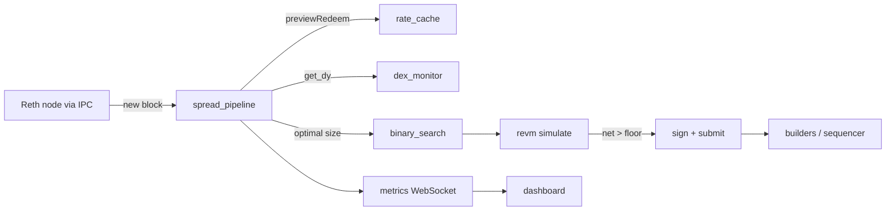

# Kestrel

_MEV arbitrage system targeting yield-bearing stablecoin mispricings on Ethereum, Arbitrum, and Gnosis._

[](./LICENSE)
[](https://www.rust-lang.org)
[](https://getfoundry.sh)

Kestrel monitors the spread between a DEX pool price and the on-chain redemption rate of ERC-4626 yield vaults (sUSDS, sDAI, sUSDe, sxDAI). When a spread exceeds gas and fee costs, it executes atomically within one block via flash loan — no upfront capital at risk. Profit floors are per-strategy and scale with live gas.

> Kestrel is unaudited. Start in monitor-only mode (`SUBMISSION_ENABLED=false`), validate the pipeline, and obtain an independent audit before deploying with real capital.

## Contents

- [Architecture](#architecture)
- [Strategies](#strategies)
- [Prerequisites](#prerequisites)
- [Configuration](#configuration)
- [Build](#build)
- [Run](#run)
- [Deploy contracts](#deploy-contracts)
- [Runtime parameters](#runtime-parameters)
- [Testing](#testing)
- [Security](#security)
- [Contributing](#contributing)
- [License](#license)

## Architecture

```
kestrel/
├── bot/                      # Rust searcher process
│   └── kestrel/src/
│       ├── main.rs                 # Entry point, chain subscriptions, supervision
│       ├── spread_pipeline.rs      # Per-block spread detection, sizing, submission
│       ├── binary_search.rs        # Optimal flash-loan size via bisection
│       ├── simulate.rs             # Local revm simulation before submission
│       ├── builders.rs             # Multi-builder bundle submission
│       ├── ssr_monitor.rs          # Sky Savings Rate monitor (dynamic thresholds)
│       ├── gas_budget.rs           # Daily gas ceiling + net-profit filter
│       ├── persistent_store.rs     # SQLite builder stats + P&L ledger
│       ├── oracle/chainlink.rs     # Chainlink price-feed monitoring
│       └── ...
├── contracts/                # Solidity (Foundry)
│   ├── src/
│   │   ├── KestrelArbitrageur.sol          # Primary sUSDS / sDAI arbitrageur
│   │   ├── KestrelFlashMintArbitrageur.sol # MakerDAO flash-mint variant
│   │   ├── KestrelSusdeArbitrageur.sol     # sUSDe cross-venue arbitrageur
│   │   ├── KestrelHook.sol                 # Uniswap V4 hook integration
│   │   └── KestrelTimelock.sol             # 24h admin timelock
│   ├── script/Deploy.s.sol
│   └── test/
├── dashboard/                # Next.js operator dashboard (WireGuard-gated)
└── infra/                    # Reth, nginx, WireGuard configs
```



## Strategies

Five strategies are spawned by `main.rs`.

| Strategy | Chain | Flash source | Direction | Status |
|---|---|---|---|---|
| ETH/sUSDS | Ethereum | Balancer | Standard redemption | Monitor-only |
| ETH/sDAI | Ethereum | Balancer | Standard redemption | Monitor-only |
| ETH/FlashMint | Ethereum | MakerDAO DssFlash | Standard redemption | Monitor-only |
| ARB/sUSDe | Arbitrum | Balancer + Aave | Cross-venue | Monitor-only |
| GNO/sxDAI | Gnosis | Balancer | Standard redemption | Monitor-only |

## Prerequisites

| Tool | Version | Install |
|---|---|---|
| Rust + Cargo | 1.78+ | `curl https://sh.rustup.rs -sSf \| sh` |
| Foundry | latest | `curl -L https://foundry.paradigm.xyz \| bash && foundryup` |
| Node.js | 20+ | via [nvm](https://github.com/nvm-sh/nvm) |
| WireGuard | any | `apt install wireguard` |
| Reth | latest | [reth docs](https://reth.rs/installation/installation.html) |

For mainnet latency, co-locate near a major relay (e.g. Equinix NY5). Arbitrum and Gnosis tolerate a well-connected VPS.

## Configuration

Copy `.env.example` to `.env` and fill in every value. The bot validates required variables at startup and panics with a clear message listing anything missing or left as a placeholder. The critical ones:

```bash
# Node connections
RETH_IPC_PATH=/var/run/reth/reth.ipc
ETH_WS_FALLBACK=wss://eth-mainnet.g.alchemy.com/v2/YOUR_KEY   # startup fallback only

# Keys (never commit)
SEARCHER_PRIVATE_KEY=0x...     # bundle-signing key, loaded via secrecy::SecretString
EXECUTOR_ADDRESS=0x...         # receives gas refunds

# Contract addresses (per deployed clone)
ARBITRAGEUR_ADDRESS=0x...
ARBITRAGEUR_SDAI_ADDRESS=0x...
ARBITRAGEUR_FLASHMINT_ADDRESS=0x...
ARB_SUSDE_ARBITRAGEUR=0x...
KESTREL_TIMELOCK_ADDRESS=0x...

# Keep false until contracts are deployed and dry-run validated
SUBMISSION_ENABLED=false
```

## Build

Bot:

```bash
cd bot
cargo build --release -p kestrel
```

Contracts:

```bash
cd contracts
forge build
```

Dashboard:

```bash
cd dashboard
npm install
npm run build
```

## Run

```bash
cd bot
RUST_LOG=kestrel=info,warn cargo run --release -p kestrel
```

With `SUBMISSION_ENABLED=false` the bot logs every detected spread, computed size, and simulated net profit without submitting. Validate the pipeline here before enabling submission.

The dashboard binds inside the WireGuard tunnel and is reachable at `http://10.0.0.1:3000`:

```bash
cd dashboard
npm run start
```

## Deploy contracts

Dry run first (no broadcast):

```bash
forge script script/Deploy.s.sol --rpc-url mainnet --private-key $DEPLOYER_PRIVATE_KEY
```

Then broadcast:

```bash
CONFIRM_DEPLOY=true forge script script/Deploy.s.sol --rpc-url mainnet --broadcast --verify
```

`Deploy.s.sol` deploys `KestrelArbitrageur`. The FlashMint, sUSDe, and Timelock contracts have dedicated scripts in `DeployStrategies.s.sol`; run each with `forge script script/DeployStrategies.s.sol:DeployFlashMint` (and `:DeploySusde`, `:DeployTimelock`).

## Runtime parameters

Adjustable without recompile. Effective floor each block is `max(STRATEGY_MIN_PROFIT_USD, gas_cost_usd × STRATEGY_GAS_MULTIPLIER)`.

| Variable | Default | Effect |
|---|---|---|
| `SUBMISSION_ENABLED` | `false` | Enables live bundle submission |
| `ETH_SUSDS_MIN_PROFIT_USD` | `300` | ETH/sUSDS hard profit floor (USD) |
| `ETH_SUSDS_GAS_MULTIPLIER` | `5.0` | Dynamic floor multiplier on gas cost |
| `ARB_SUSDE_MIN_PROFIT_USD` | `50` | ARB/sUSDe hard profit floor (USD) |
| `GNO_SXDAI_MIN_PROFIT_USD` | `20` | GNO/sxDAI hard profit floor (USD) |
| `MIN_SPREAD_BPS` | `5` | Minimum spread to trigger the pipeline |
| `DAILY_GAS_LIMIT_ETH` | `0.5` | Daily gas ceiling — bot pauses when exceeded |
| `MAX_PRIORITY_FEE_GWEI` | `10` | Hard ceiling on adaptive priority fee |
| `RUST_LOG` | `kestrel=info,warn` | Log filter |

## Testing

```bash
# Bot
cd bot && cargo test -p kestrel

# Contracts
cd contracts && forge test -vv
FOUNDRY_FUZZ_RUNS=10000 forge test
```

## Security

Report vulnerabilities per the [security policy](./SECURITY.md). Private keys live in `.env` only; `SEARCHER_PRIVATE_KEY` is loaded through `secrecy::SecretString`. The dashboard and metrics ports bind to loopback or the WireGuard interface, never to `0.0.0.0`. Admin operations are intended to route through `KestrelTimelock`. This code is unaudited — do not use in production without your own review.

## Contributing

See [CONTRIBUTING.md](./CONTRIBUTING.md) for dev setup and PR guidelines.

## License

Released under the [MIT License](./LICENSE).
